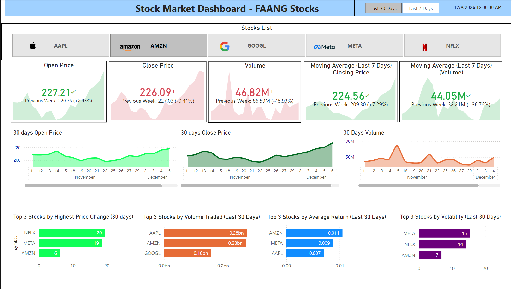

# 1. Real-Time Stock Market Insights Dashboard 📊💹

## Introduction 🌟
Welcome to the **Real-Time Stock Market Insights Dashboard** project! This innovative solution is designed to fetch and visualize stock market data for major FAANG companies—Meta, Apple, Amazon, Netflix, and Google. With the help of the Alpha Vantage API, this dashboard pulls real-time and historical stock data, providing an up-to-date view of stock performance. The data is seamlessly integrated into a PostgreSQL database, where it can be queried for analysis and displayed through dynamic Power BI dashboards.

This project enables users to explore various stock performance metrics, including price changes, trading volume, and other key indicators, over customizable time periods. Whether you're a data enthusiast, financial analyst, or simply tracking the performance of your favorite stocks, this project offers an automated and interactive way to gain insights from real-time data.

## Technologies Used 🛠️
The **Real-Time Stock Market Insights Dashboard** uses a combination of technologies to ensure efficient data collection, storage, and visualization:
- **Python 🐍**: A powerful scripting language used for fetching stock data, processing it, and interacting with APIs.
- **Alpha Vantage API 📡**: Provides free access to high-quality stock market data, including time-series data for historical and real-time stock prices.
- **PostgreSQL 🗄️**: A reliable relational database management system used for storing and managing stock data securely and efficiently.
- **AWS Lambda ☁️**: A serverless computing service that automates the process of fetching stock data and inserting it into the PostgreSQL database on a regular basis.
- **Power BI 📊**: A business analytics tool used to visualize and create interactive dashboards from the data stored in the PostgreSQL database, offering insights into stock market trends.


# Table of Contents

[Getting the API Key](#getting-the-api-key)
[Setting Up the AWS RDS Database ](#setting-up-the-aws-rds-database)
   - [Creating the RDS Database](#creating-the-rds-database)
   - [Setting Up the Database on AWS RDS](#setting-up-the-database-on-aws-rds)
   - [Connecting to the Database Using pgAdmin](#connecting-to-the-database-using-pgadmin)
[How the Data is Fetched](#how-the-data-is-fetched)
   - [Fetching the Last 30 Days of Data](#fetching-the-last-30-days-of-data)
   - [Fetching Daily Data and Setting Up Lambda](#fetching-daily-data-and-setting-up-lambda)
[Setting Up the Power BI Dashboard ](#setting-up-the-power-bi-dashboard)
   - [Setting Up the Power BI Connection to PostgreSQL](#setting-up-the-power-bi-connection-to-postgresql)
   - [Visuals, Measures, and Their Purpose in the Dashboard](#visuals-measures-and-their-purpose-in-the-dashboard)
[Final Thoughts ✨](#final-thoughts-✨)


---

### Getting the API Key 
To access stock market data from the Alpha Vantage API, you'll need to create an API key. Follow these steps to obtain one:

1. Go to the [Alpha Vantage API Key page](https://www.alphavantage.co/support/#api-key).
2. Click on the **"Get your free API key"** button.
3. If you already have an account, log in with your credentials. Otherwise, click **"Sign up"** to create a new account.
4. Once logged in, you’ll be redirected to a page where your personal API key will be displayed.
5. Copy the API key and paste it in the `api_key` variable in the provided Python code to use it in your project.

---


###  Setting Up the AWS RDS Database 

#### Creating the RDS Database

To set up a PostgreSQL database on AWS RDS, follow these steps:

1. **Create an AWS Account**:
   - If you don’t have an AWS account, sign up on [AWS](https://aws.amazon.com/).

2. **Create a PostgreSQL Database on RDS**:
   - Navigate to the RDS Dashboard in AWS.
   - Click on **Create Database** and select **PostgreSQL** as the engine.
   - Choose **Standard Create** and configure the following settings:
     - **DB instance identifier**: Give your database instance a name (e.g., `stock-database`).
     - **Master username**: Choose a username for the database (e.g., `admin`).
     - **Master password**: Set a password for the database.
     - **DB instance size**: Select the appropriate instance size (e.g., Free tier or a suitable instance type based on your needs).
     - **Storage**: Choose the storage type and size.
     - **VPC**: Choose the default VPC or configure your own network settings.
   - After configuring, click **Create Database** and wait for the instance to be created.

#### Setting Up the Database on AWS RDS

1. **Modify the Database Security Group**:
   - After creating the RDS instance, go to the **Security Groups** tab.
   - Click on the **Security group ID** and add an inbound rule to allow PostgreSQL traffic (default port is `5432`) from your IP or IP range.

2. **Get the Endpoint**:
   - Once the RDS instance is available, go to the **Databases** section in the AWS RDS console.
   - Click on your database instance and copy the **Endpoint** (this will be the host you’ll use to connect to the database).

#### Connecting to the Database Using pgAdmin

To manage and interact with your PostgreSQL database, you can use **pgAdmin**, a graphical management tool. Follow these steps to connect to your AWS RDS PostgreSQL database using pgAdmin:

1. **Install pgAdmin**:
   - If you don’t have pgAdmin installed, download and install it from the [pgAdmin website](https://www.pgadmin.org/).

2. **Open pgAdmin and Create a New Connection**:
   - Open **pgAdmin** and log in.
   - In the left sidebar, right-click on **Servers** and select **Create > Server**.

3. **Configure the Server Connection**:
   - In the **General** tab, give your connection a name (e.g., `AWS RDS PostgreSQL`).
   - In the **Connection** tab, fill in the following details:
     - **Host name/address**: Enter the **Endpoint** of your RDS database.
     - **Port**: Enter `5432` (default PostgreSQL port).
     - **Username**: Enter the **Master username** you set when creating the RDS instance.
     - **Password**: Enter the **Master password** you set when creating the RDS instance.
   - Click **Save** to establish the connection.

4. **Create the `stock_data` Table**:
   - After connecting to your AWS RDS PostgreSQL database, open the **Query Tool** in pgAdmin.
   - Paste the following SQL command to create the `stock_data` table:

```sql
CREATE TABLE stock_data (
    id SERIAL PRIMARY KEY,
    symbol VARCHAR(10) NOT NULL,
    timestamp DATE NOT NULL,
    open_price NUMERIC,
    high_price NUMERIC,
    low_price NUMERIC,
    close_price NUMERIC,
    volume BIGINT,
    CONSTRAINT unique_stock_timestamp UNIQUE(symbol, timestamp)
);
```
Click Execute to run the query and create the table.


###  How the Data is Fetched 

The data for this project is fetched using the **Alpha Vantage API**, a free service that provides real-time and historical stock data. The data fetching process is broken down into two main steps:

###  **Fetching the Last 30 Days of Stock Data**

To fetch the last 30 days of stock data, we will use the `fetch_last_30days.py` script. The steps involved are:

#### a. **Making an API Request**

The first step is to make a request to the Alpha Vantage API. The endpoint used for this request is:

https://www.alphavantage.co/query?function=TIME_SERIES_DAILY&symbol=<SYMBOL>&apikey=<API_KEY>


Where:
- `<SYMBOL>` is the stock symbol (e.g., `AAPL` for Apple, `GOOGL` for Google).
- `<API_KEY>` is your unique Alpha Vantage API key.

#### b. **Parsing the API Response**

The API responds with data in JSON format. An example of the response structure is as follows:

```json
{
    "Meta Data": {
        "1. Information": "Daily Prices and Volumes",
        "2. Symbol": "AAPL",
        "3. Last Refreshed": "2024-12-22",
        "4. Interval": "1 day",
        "5. Output Size": "Compact",
        "6. Time Zone": "US/Eastern"
    },
    "Time Series (Daily)": {
        "2024-12-22": {
            "1. open": "150.00",
            "2. high": "152.50",
            "3. low": "149.00",
            "4. close": "150.80",
            "5. volume": "1000000"
        },
        "2024-12-21": {
            "1. open": "151.00",
            "2. high": "153.00",
            "3. low": "150.50",
            "4. close": "152.30",
            "5. volume": "950000"
        }
        
    }
}
```

#### c. **Filtering the Data** 🧹

Once the API response is received, the next step is to filter out the relevant data for the last 30 days. This is done by comparing the dates in the response to the current date. We retrieve the stock data from the `Time Series (Daily)` section of the API response and filter it based on the current date.

The Python script performs the following steps:

1. **Get the Current Date**: The script fetches today’s date using `datetime.now()`.
2. **Filter the Data**: It then loops through the `Time Series (Daily)` data and selects only the entries where the date is within the last 30 days.

Here is the code used for filtering the stock data:

```python
from datetime import datetime, timedelta

# Get today's date
today = datetime.now()

# Loop through the data and filter out the last 30 days
recent_data = {
    k: v for k, v in time_series.items()
    if datetime.strptime(k, '%Y-%m-%d') >= today - timedelta(days=30)
}
```

#### d . ** Running the code**


To fetch the last 30 days of stock data, we will use the `fetch_last_30days.py` script. Follow the steps below to set everything up and run the code.

### 1. **Set Environment Variables** 🔑

Before running the script, you'll need to set some environment variables for the Alpha Vantage API and your database connection. These include:

- `api_key`: Your Alpha Vantage API key.
- `db_name`: Your database name (e.g., `stock_data`).
- `db_user`: Your database username.
- `db_password`: Your database password.
- `db_host`: Your database host (e.g., `localhost`).
- `db_port`: Your database port (usually `5432` for PostgreSQL).

Here’s how you define them in your script:

```python
api_key = 'Enter your API key here'  # Alpha Vantage API Key
db_name = 'Enter your database name here'  # Your database name
db_user = 'Enter your database username here'  # Your database username
db_password = 'Enter your database password here'  # Your database password
db_host = 'Enter your database host here'  # Your database host (e.g., 'localhost')
db_port = 'Enter your database port here'  # Your database port (e.g., 5432 for PostgreSQL)
```
Make sure to replace the placeholder values with your actual credentials.

Run the script: You can now run the script by executing the following command:
```python
python fetch_last_30days.py
```
Verify Data Insertion: After running the script, check your PostgreSQL database (e.g., using pgAdmin or another SQL client) to verify that the stock data has been correctly inserted into the stock_data table.


####  Fetching Daily Data and Setting Up Lambda

In this step, the stock data for each selected stock symbol is fetched on a daily basis using the Alpha Vantage API. The `TIME_SERIES_DAILY` function of the API provides daily open, high, low, close, and volume data for a specified stock symbol. We retrieve this data using a GET request.

The script works as follows:

1. **API URL Construction**: The URL for the API request is constructed using the base URL `https://www.alphavantage.co/query` along with the stock symbol and the API key.
2. **Send the GET Request**: The script sends a GET request to the Alpha Vantage API, passing the stock symbol and API key as parameters.
3. **Parse the Response**: After receiving the API response, the script checks if the data exists in the `Time Series (Daily)` field of the response. If the data is available, it is returned in JSON format.
4. **Error Handling**: If the API fails to return valid data (e.g., if the API limit is exceeded), the script raises an error message indicating the failure.

Here’s the code used for fetching the stock data:

```python
import requests

def fetch_stock_data(stock):
    """Fetch the daily stock data for the given stock symbol."""
    url = f'https://www.alphavantage.co/query?function=TIME_SERIES_DAILY&symbol={stock}&apikey={api_key}'
    response = requests.get(url)
    data = response.json()
    
    # Check if the response contains valid data
    if 'Time Series (Daily)' in data:
        return data['Time Series (Daily)']
    else:
        raise ValueError(f"Failed to fetch data for {stock}: {data.get('Error Message')}")
```
### Setting Up Lambda for Scheduled Fetches ⚙️

To automate the process of fetching stock data, we'll use **AWS Lambda** to run the `lambda_function.py` script. This Lambda function will be triggered by **AWS CloudWatch Events** to run on a schedule. Here's how to set it up:

#### 1. **Create a Lambda Function**

1. **Navigate to the AWS Lambda Console**:
   - Open the AWS Management Console and go to the Lambda service.
   
2. **Create a New Lambda Function**:
   - Click on "Create function."
   - Choose "Author from scratch."
   - **Function name**: `fetch_stock_data`.
   - **Runtime**: Python 3.8 or later.
   - **Role**: Create a new role with basic Lambda permissions.
   
3. **Upload Your Lambda Code**:
   - In the Lambda function's console, upload your `lambda_function.zip` .

4. **Testing the Lambda function **:

After uploading the zip file, you can test your Lambda function using the Lambda console. Follow these steps:

1. **Create a Test Event**:
   - In the Lambda console, go to your newly created function (`fetch_stock_data`).
   - Click on the "Test" button at the top right of the page.
   - You'll be prompted to configure a test event. Choose **"Create new test event"**.
   - For the event name, use something like `TestEvent`.
   - Leave the event template as the default or configure an empty JSON event (since no input data is required for this example). 

2. **Run the Test**:
   - Once the test event is configured, click the **Test** button again to manually trigger the Lambda function.
   - The Lambda function will execute, and you will see the test results displayed.

3. **Check the Execution Results**:
   - After running the test, Lambda will provide you with the test result, showing whether it was successful or not.
   - If successful, you should see a **200 status code** in the response body.

4. **View CloudWatch Logs for Debugging**:
   - If the test results indicate an issue or if you want to view the details of the execution, go to the **CloudWatch Logs** section.
   - In the CloudWatch console, navigate to the **Logs** section and search for your Lambda function’s logs.
   - You can review the logs to check for any errors or see the successful execution of the Lambda function.

### Setting Up CloudWatch Event for Scheduled Lambda Triggers ⏲️

To automate the running of your Lambda function, you'll use **AWS CloudWatch Events** to schedule when the function should be triggered. Here’s how to set up the CloudWatch Event:

#### 1. **Navigate to CloudWatch Console**:

- Open the AWS Management Console and go to the **CloudWatch** service.

#### 2. **Create a New Rule**:

- In the left sidebar, click on **Rules** under the **Events** section.
- Click on the **Create rule** button.

#### 3. **Configure the Event Source**:

- In the **Create Rule** section, select **Schedule** as the event source.
- Define the frequency for triggering your Lambda function. You can use a cron expression or rate expression. For example:
  - **Rate expression**: `rate(1 day)` (to trigger once every day).
  - **Cron expression**: `cron(0 12 * * ? *)` (to trigger every day at 12:00 PM UTC).

#### 4. **Select the Target**:

- Under **Targets**, click **Add target**.
- Select **Lambda function** from the dropdown menu.
- In the **Function** field, select the `fetch_stock_data` Lambda function.
- Check the box for **Create a new role for this specific resource** if you don't have a role already set up for Lambda to be triggered by CloudWatch. This step grants CloudWatch permissions to invoke the Lambda function.

#### 5. **Configure Additional Options** (Optional):

- You can set up additional configurations like dead-letter queues or retry policies if needed.

#### 6. **Create the Rule**:

- After configuring the rule, click **Create** to finalize the CloudWatch Event setup.
  
The CloudWatch Event will now trigger the Lambda function according to the schedule you specified. You can always modify the event schedule by going back to the **Rules** section in the CloudWatch console.

#### 7. **Verify the CloudWatch Event Trigger**:

- To ensure the CloudWatch Event is working as expected, you can check the **CloudWatch Logs** to verify that the Lambda function was triggered at the scheduled time.
- You can also manually execute the CloudWatch Event to confirm everything is set up correctly.

### Setting Up the Power BI Dashboard 

#### Setting Up the Power BI Connection to PostgreSQL

In this section, we will set up a dashboard to visualize the stock data in **Power BI**. We will use **ODBC (Open Database Connectivity)** to connect Power BI to the **AWS RDS PostgreSQL database**, where the stock data is stored.

### 1. **Installing ODBC Driver for PostgreSQL**

Before connecting Power BI to PostgreSQL, you need to install the **ODBC driver** for PostgreSQL to allow Power BI to communicate with the AWS RDS database.

#### a. **Download and Install the ODBC Driver**:

1. **Download the ODBC driver**:
   - Go to the [PostgreSQL ODBC Driver](https://www.postgresql.org/ftp/odbc/versions/msi/) page and download the appropriate version for your system (e.g., `psqlODBC` for Windows).
   
2. **Install the Driver**:
   - Run the downloaded installer and follow the instructions to install the driver.

3. **Verify Installation**:
   - Once installed, you can verify the ODBC driver by opening the **ODBC Data Source Administrator** on Windows (type "ODBC" in the Start menu). You should see `PostgreSQL` listed as one of the drivers.

#### b. **Configure ODBC Connection**:

1. Open the **ODBC Data Source Administrator** on your computer.
2. Go to the **System DSN** tab and click **Add**.
3. Select the **PostgreSQL ODBC Driver** and click **Finish**.
4. Configure the ODBC connection:
   - **Data Source Name**: `StockDatabase`.
   - **Server**: Enter the endpoint of your AWS RDS instance.
   - **Port**: 5432 (default PostgreSQL port).
   - **User**: Enter the PostgreSQL master username.
   - **Password**: Enter the password.
   - **Database**: Enter the database name.

Click **Test** to ensure the connection works and then click **OK**.

### 2. **Connecting Power BI to PostgreSQL using ODBC**

1. Open **Power BI Desktop**.
2. In the **Home** tab, click on **Get Data**.
3. In the "Get Data" window, select **ODBC** from the list of data sources and click **Connect**.
4. In the **ODBC** connection dialog:
   - Select the **Data Source Name** you created earlier (`StockDatabase`).
   - Enter your credentials if prompted, then click **Connect**.
5. Power BI will establish a connection to your PostgreSQL database, and you can now choose the tables you want to load into Power BI (e.g., `stock_data`).

### 3. **Loading the Data into Power BI**

1. After selecting the tables, click **Load** to bring the data into Power BI.
2. The data will now appear in the **Fields** pane of Power BI, where it will automatically sync up with the  visualizations.


### 4. **Refreshing Data**

Since stock data is fetched regularly, you will want to ensure that your Power BI dashboard is updated accordingly.

#### a. **Refresh Data in Power BI Desktop**:
1. Click on **Home** in the Power BI ribbon and select **Refresh** to manually refresh the data.

#### b. **Schedule Data Refresh in Power BI Service**:
If you're using Power BI Service to host the dashboard:
1. Publish your Power BI report to Power BI Service.
2. Go to the **Datasets** section in Power BI Service and find your dataset.
3. Click on the **Schedule Refresh** option and set the refresh schedule to match your data fetching frequency (e.g., daily).

With these steps, you can create a real-time, automated stock analysis dashboard in Power BI.

---

### Visuals, Measures, and Their Purpose in the Dashboard

In this section, we will go over the various visualizations used in the Power BI dashboard.

<p align="center">
  
</p>


## 7. Final Thoughts ✨

By integrating AWS Lambda, PostgreSQL, and Power BI, we’ve automated the process of fetching, storing, and visualizing stock market data in a powerful, dynamic dashboard. This setup allows for easy monitoring of stock data, with real-time updates and the ability to scale as more data becomes available.
